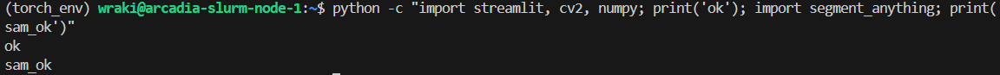
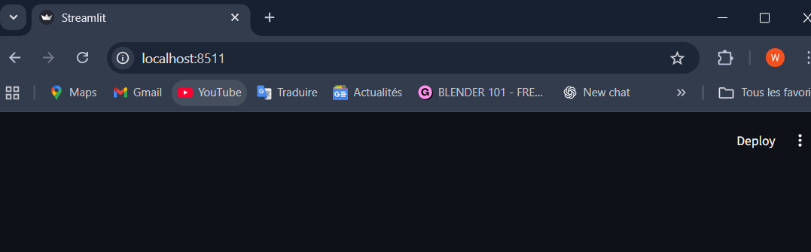
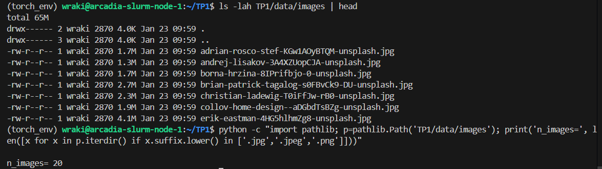
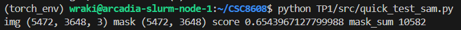
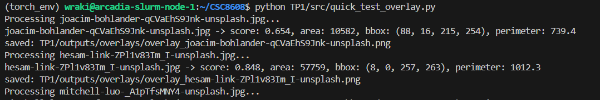
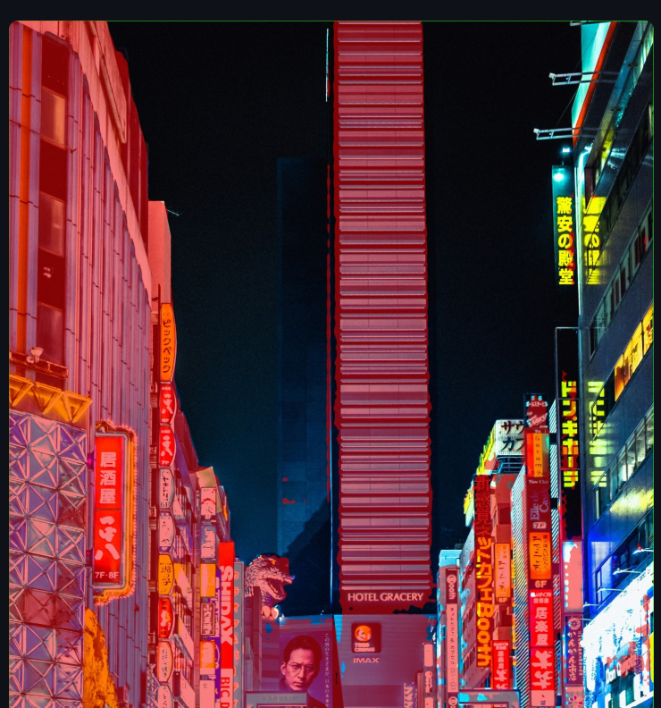
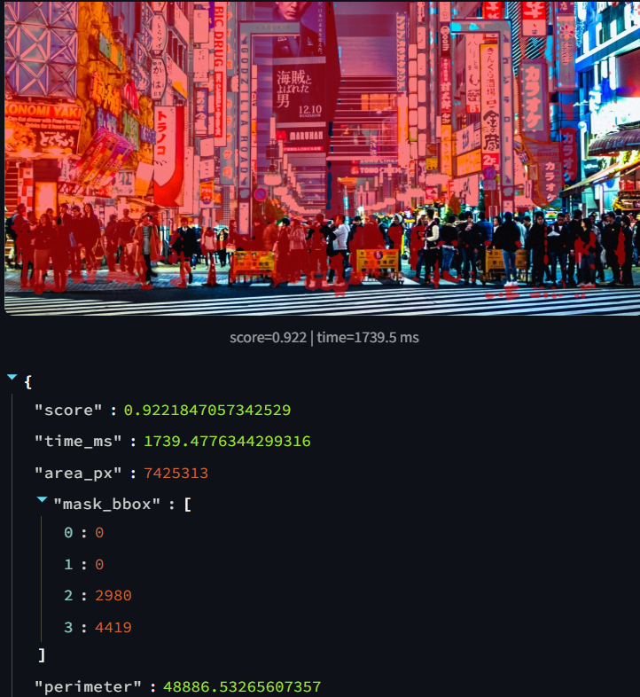
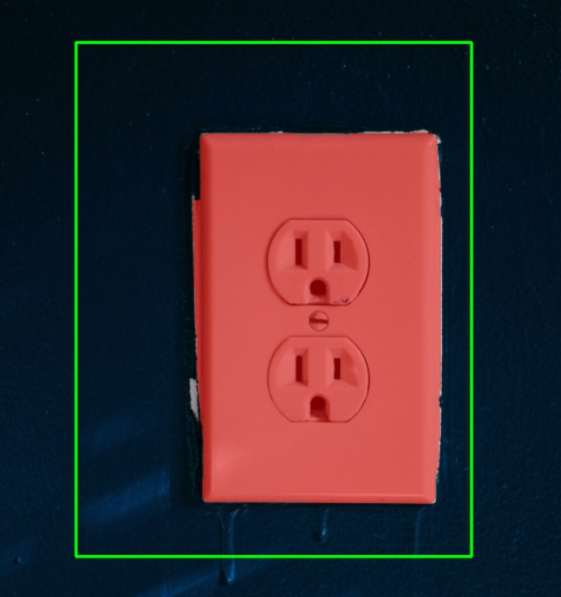

# TP1 — Segment Anything (SAM)
Nom: RAKI Wiame
## Dépôt du projet
Lien du dépôt Git :
https://github.com/<username>/<repo>  


## Arboresence TP1:
```markdown
TP1/
├── data/
│   └── images/
├── src/
│   ├── app.py
│   ├── sam_utils.py
│   ├── geom_utils.py
│   └── viz_utils.py
├── outputs/
│   ├── overlays/
│   └── logs/
├── report/
│   └── report.md
├── requirements.txt
└── README.md
```
## Environnement d’exécution
Le TP a été exécuté sur un **nœud GPU via SLURM**.

- Machine : `arcadia-slurm-node-1`
- Accès GPU : via allocation SLURM (`srun --gres=gpu:1`)

## Environnement logiciel
- Gestionnaire d’environnement : **conda (Miniforge)**
- Environnement activé :
```bash
torch_env
```
- Version :
```bash
cpu = _conversion_method_template(device=torch.device("cpu"))
torch 2.5.1
cuda_available True
device_count 1
```
## `segment_anything` fonctionne


## Streamlit:
- Port choisi : `8511`

**UI accessible via SSH tunnel : oui**

## Question 2:
*images récupérées via recherche web* 


1. **`mockup-graphics-_mUVHhvBYZ0-unsplash.jpg`** (Feuilles sur fond blanc)
> C'est l'archétype parfait de l'image **“simple”** avec un sujet organique unique et un fond blanc uni, idéal pour évaluer la précision des contours.


2. **`adrian-rosco-stef-KGw1AOyBTQM-unsplash.jpg`** (Cheveux roux)
> Elle représente la catégorie **“difficile”** par excellence, mettant au défi la gestion des textures fines (cheveux) et des reflets lumineux complexes.


3. **`yoav-aziz-tKCd-IWc4gI-unsplash.jpg`** (Ruelle avec lanternes)
> Une superbe image **“chargée”** qui cumule les difficultés : perspective profonde, nombreux objets qui se chevauchent (occlusion) et éclairage varié.


4. **`jezael-melgoza-_noSmX8Kgoo-unsplash.jpg`** (Rue néons violets)
> Sélectionnée pour son fond **“chargé”** urbain moderne, elle teste la capacité à gérer des sources de lumière artificielles intenses et une foule en mouvement.


5. **`brian-patrick-tagalog-s0FBvCk9-DU-unsplash.jpg`** (Prise électrique)
> Une image **“simple”** intéressante car, contrairement aux feuilles, elle n'est pas sur fond blanc : elle teste la gestion des ombres portées et du faible contraste sur le mur bleu.

### Cas simple:

### Cas complexe:


## Question 3 :

**Modèle choisi :** `vit_h`
**Checkpoint utilisé :** `sam_vit_h_4b8939.pth`

**Sortie du test rapide :**



**Premier constat :**
Le modèle fonctionne correctement et détecte le masque principal. L’inférence est un peu lente sur des images de très haute résolution (ici 5472×3648). On remarque que certains détails fins ne sont pas parfaitement segmentés, mais globalement le masque est cohérent. Ce test permet de vérifier que l’intégration de SAM avec le SamPredictor est opérationnelle.

## Question 4 :

### 1. Vignette d’un overlay produit





### 2. Tableau récapitulatif (Sélection de 3 images)

| Image (Fichier) | Score (Confiance) | Aire (px²) | Périmètre (px) |
| --- | --- | --- | --- |
| **christian-ladewig-T0iFfJw-rB0-unsplash** (Cas simple) | 0.986 | 54230 | 990.1 |
| **yoav-aziz-tKCd-IWc4gI-unsplash** (Cas chargé) | 0.944 | 39730 | 901.0 |
| **joacim-bohlander-qCVaEhS9Jnk-unsplash** (Score bas) | 0.654 | 10582 | 739.4 |

### 3. Commentaire : Utilité de l’overlay pour le débogage

L'overlay visuel est indispensable car les métriques brutes (comme le score de 0.654 ci-dessus) ne disent pas *pourquoi* le modèle hésite. En superposant le masque à l'image originale, on peut identifier immédiatement si le problème vient du **prompt** (une boîte qui inclut trop de contexte parasite) ou du **modèle** (qui échoue à séparer l'objet du fond à cause d'un faible contraste ou d'une texture complexe). Cela permet de distinguer une erreur de segmentation grossière (le masque couvre le mauvais objet) d'une imprécision fine (bords flous ou cheveux manquants), guidant ainsi l'ajustement des hyperparamètres.

## Question 5 :

### 1. Cas difficile




### 2. Cas simple

Voici le tableau récapitulatif des tests effectués et l'analyse du comportement de la BBox.

### Tableau des résultats

| Image (Fichier) | BBox `[x1, y1, x2, y2]` | Score | Aire (px²) | Temps (ms) |
| --- | --- | --- | --- | --- |
| **erik-eastman-4HG5hlhmZg8-unsplash.jpg** | `[0, 0, 2980, 4419]` | 0.922 | 7 425 313 | 1739.5 |
| **borna-hrzina-8IPrifbjo-0-unsplash.jpg** | `[0, 0, 3006, 4012]` | 0.949 | 10 329 487 | 1708.3 |
| **andrej-lisakov-3A4XZUopCJA-unsplash.jpg** | `[0, 13, 5199, 3562]` | 1.000 | 17 367 054 | 1802.5 |

### Debug : Impact de la taille de la BBox
Lorsqu'on **rétrécit** la bbox pour qu'elle épouse strictement les contours de l'objet, on réduit l'ambiguïté contextuelle : le modèle se concentre sur les détails internes et exclut le fond, ce qui produit un masque plus utile et précis, même si le score de confiance peut parfois baisser légèrement (car la tâche devient plus complexe que de simplement détourer un rectangle). À l'inverse, si on **agrandit** trop la bbox (comme dans les résultats ci-dessus où elle couvre toute l'image), SAM a tendance à segmenter l'objet "dominant" le plus évident, qui est souvent le fond ou la scène entière. Cela explique les scores très élevés (proches de 1.0) et les aires gigantesques : le modèle a réussi sa segmentation technique, mais n'a pas isolé l'objet spécifique qu'on visait.