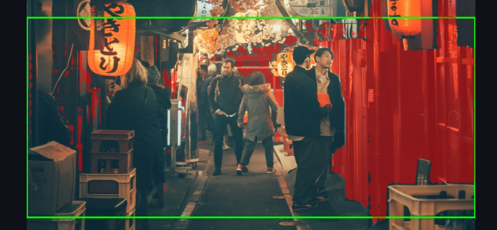
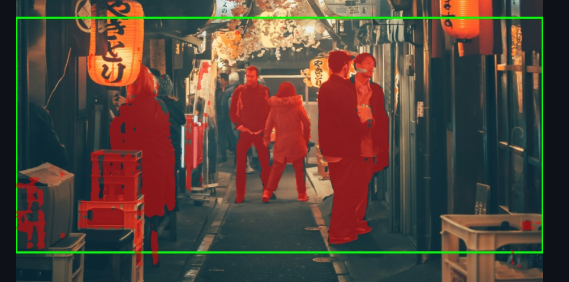
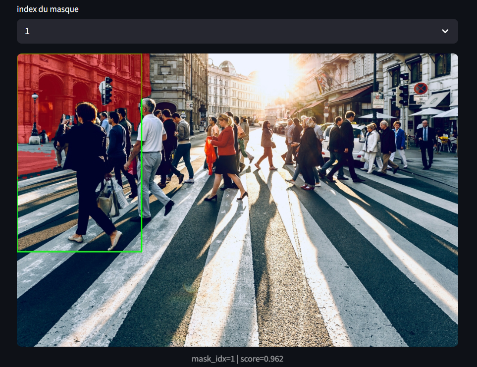
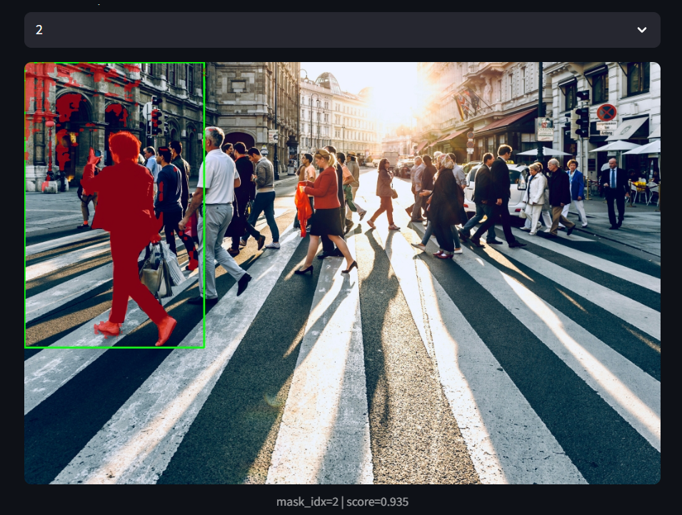

# TP1 — Segment Anything (SAM)
Nom: RAKI Wiame
## Dépôt du projet
Lien du dépôt Git :
https://github.com/<username>/<repo>  


## Arboresence TP1:
```markdown
TP1/
├── data/
│   └── images/
├── src/
│   ├── app.py
│   ├── sam_utils.py
│   ├── geom_utils.py
│   └── viz_utils.py
├── outputs/
│   ├── overlays/
│   └── logs/
├── report/
│   └── report.md
├── requirements.txt
└── README.md
```
## Environnement d’exécution
Le TP a été exécuté sur un **nœud GPU via SLURM**.

- Machine : `arcadia-slurm-node-1`
- Accès GPU : via allocation SLURM (`srun --gres=gpu:1`)

## Environnement logiciel
- Gestionnaire d’environnement : **conda (Miniforge)**
- Environnement activé :
```bash
torch_env
```
- Version :
```bash
cpu = _conversion_method_template(device=torch.device("cpu"))
torch 2.5.1
cuda_available True
device_count 1
```
## `segment_anything` fonctionne


## Streamlit:
- Port choisi : `8511`

**UI accessible via SSH tunnel : oui**

## Question 2:
*images récupérées via recherche web* 


1. **`mockup-graphics-_mUVHhvBYZ0-unsplash.jpg`** (Feuilles sur fond blanc)
> C'est l'archétype parfait de l'image **“simple”** avec un sujet organique unique et un fond blanc uni, idéal pour évaluer la précision des contours.


2. **`adrian-rosco-stef-KGw1AOyBTQM-unsplash.jpg`** (Cheveux roux)
> Elle représente la catégorie **“difficile”** par excellence, mettant au défi la gestion des textures fines (cheveux) et des reflets lumineux complexes.


3. **`yoav-aziz-tKCd-IWc4gI-unsplash.jpg`** (Ruelle avec lanternes)
> Une superbe image **“chargée”** qui cumule les difficultés : perspective profonde, nombreux objets qui se chevauchent (occlusion) et éclairage varié.


4. **`jezael-melgoza-_noSmX8Kgoo-unsplash.jpg`** (Rue néons violets)
> Sélectionnée pour son fond **“chargé”** urbain moderne, elle teste la capacité à gérer des sources de lumière artificielles intenses et une foule en mouvement.


5. **`brian-patrick-tagalog-s0FBvCk9-DU-unsplash.jpg`** (Prise électrique)
> Une image **“simple”** intéressante car, contrairement aux feuilles, elle n'est pas sur fond blanc : elle teste la gestion des ombres portées et du faible contraste sur le mur bleu.

### Cas simple:

### Cas complexe:


## Question 3 :

**Modèle choisi :** `vit_h`
**Checkpoint utilisé :** `sam_vit_h_4b8939.pth`

**Sortie du test rapide :**


**Premier constat :**
Le modèle fonctionne correctement et détecte le masque principal. L’inférence est un peu lente sur des images de très haute résolution (ici 5472×3648). On remarque que certains détails fins ne sont pas parfaitement segmentés, mais globalement le masque est cohérent. Ce test permet de vérifier que l’intégration de SAM avec le SamPredictor est opérationnelle.

## Question 4 :

### 1. Vignette d’un overlay produit


### 2. Tableau récapitulatif (Sélection de 3 images)

| Image (Fichier) | Score (Confiance) | Aire (px²) | Périmètre (px) |
| --- | --- | --- | --- |
| **christian-ladewig-T0iFfJw-rB0-unsplash** (Cas simple) | 0.986 | 54230 | 990.1 |
| **yoav-aziz-tKCd-IWc4gI-unsplash** (Cas chargé) | 0.944 | 39730 | 901.0 |
| **joacim-bohlander-qCVaEhS9Jnk-unsplash** (Score bas) | 0.654 | 10582 | 739.4 |

### 3. Commentaire : Utilité de l’overlay pour le débogage

L'overlay visuel est indispensable car les métriques brutes (comme le score de 0.654 ci-dessus) ne disent pas *pourquoi* le modèle hésite. En superposant le masque à l'image originale, on peut identifier immédiatement si le problème vient du **prompt** (une boîte qui inclut trop de contexte parasite) ou du **modèle** (qui échoue à séparer l'objet du fond à cause d'un faible contraste ou d'une texture complexe). Cela permet de distinguer une erreur de segmentation grossière (le masque couvre le mauvais objet) d'une imprécision fine (bords flous ou cheveux manquants), guidant ainsi l'ajustement des hyperparamètres.

## Question 5 :

### 1. Cas difficile


### 2. Cas simple


### Tableau des résultats

| Image (Fichier) | BBox `[x1, y1, x2, y2]` | Score | Aire (px²) | Temps (ms) |
| --- | --- | --- | --- | --- |
| **erik-eastman-4HG5hlhmZg8-unsplash.jpg** | `[0, 0, 2980, 4419]` | 0.922 | 7 425 313 | 1739.5 |
| **borna-hrzina-8IPrifbjo-0-unsplash.jpg** | `[0, 0, 3006, 4012]` | 0.949 | 10 329 487 | 1708.3 |
| **andrej-lisakov-3A4XZUopCJA-unsplash.jpg** | `[0, 13, 5199, 3562]` | 1.000 | 17 367 054 | 1802.5 |

### Debug : Impact de la taille de la BBox
Lorsqu'on **rétrécit** la bbox pour qu'elle épouse strictement les contours de l'objet, on réduit l'ambiguïté contextuelle : le modèle se concentre sur les détails internes et exclut le fond, ce qui produit un masque plus utile et précis, même si le score de confiance peut parfois baisser légèrement (car la tâche devient plus complexe que de simplement détourer un rectangle). À l'inverse, si on **agrandit** trop la bbox (comme dans les résultats ci-dessus où elle couvre toute l'image), SAM a tendance à segmenter l'objet "dominant" le plus évident, qui est souvent le fond ou la scène entière. Cela explique les scores très élevés (proches de 1.0) et les aires gigantesques : le modèle a réussi sa segmentation technique, mais n'a pas isolé l'objet spécifique qu'on visait.

## Question 6 :

### Comparaison Avant / Après

#### Cas 1 : 
**Avant**

**Après**

Ici, la BBox seule capture le décor (murs, lanternes). L'ajout de **2 points positifs** (FG) force le modèle à se concentrer sur les personnes au centre.

* **Liste des points ajoutés :**
* Point 1 : `x: 357, y: 629` — **FG (Objet)**
* Point 2 : `x: 525, y: 629` — **FG (Objet)**


* **Masque retenu :** Index 1

#### Cas 2 : 
**Avant**

**Après**

Dans ce cas, la BBox englobe le piéton et le bâtiment derrière. Par défaut, SAM a segmenté le bâtiment (le "fond" rouge dans la 1ère image). Un **point unique** sur le torse du piéton suffit pour inverser la sélection.

* **Liste des points ajoutés :**
* Point 1 : `x: 162, y: 222` — **FG (Objet)**

* **Masque retenu :** Index 2 


### Analyse : L'importance des points (Debug)

Les points **BG (Background)** et **FG (Foreground)** deviennent indispensables lorsque la BBox contient plusieurs objets saillants (ambiguïté spatiale) ou que l'objet cible a une texture très proche du fond (faible contraste).

1. **Usage typique :** Un point **FG** sert à dire "Ceci est l'objet" (comme pour le piéton ci-dessus), tandis qu'un point **BG** est crucial pour "trouer" un masque qui déborde (ex: supprimer l'espace entre le bras et le corps, ou exclure un autre objet voisin inclus par erreur).
2. **Limites :** Les cas restent difficiles si l'objet est très fin (grillage, cheveux) ou transparent : même avec des points, SAM peut peiner à trouver la frontière exacte si les gradients de pixels ne sont pas nets.


## Question 7 : Principaux facteurs d'échec et pistes d'amélioration

Les 3 principaux facteurs qui font échouer la segmentation sur les images de test sont :

1.  **Le manque de contraste et les fonds complexes** : Lorsque l'objet se confond avec l'arrière-plan (couleurs ou textures similaires), le modèle peine à délimiter ses contours avec précision. C'est visible sur les images avec des ombres portées ou des objets sur des fonds texturés.
2.  **La finesse et la complexité des détails** : Les structures très fines (comme les cheveux sur l'image `adrian-rosco-stef-KGw1AOyBTQM-unsplash.jpg`) ou les objets avec des trous sont souvent mal capturées, menant à des masques incomplets ou grossiers.
3.  **L'ambiguïté de l'objet ou les occlusions** : Sur les scènes chargées (comme `yoav-aziz-tKCd-IWc4gI-unsplash.jpg`), si l'objet est partiellement masqué ou si plusieurs objets similaires sont proches, le modèle peut avoir du mal à isoler l'instance correcte ou à deviner les parties cachées.

Actions concrètes pour améliorer la situation :

*   **Data** : Augmenter le jeu de données avec des images présentant ces cas difficiles (fonds complexes, objets fins, occlusions) pour ré-entraîner ou affiner le modèle. On pourrait aussi utiliser des données synthétiques pour cibler des cas précis.
*   **UI** : Permettre à l'utilisateur de guider plus finement la segmentation en ajoutant des **points positifs (sur l'objet) et négatifs (sur le fond)**, comme exploré dans la question 6. Une interface permettant de dessiner un polygone approximatif serait encore plus précise qu'une simple BBox.
*   **Pipeline** : Intégrer des étapes de **post-traitement** pour affiner les masques (ex: des opérations morphologiques comme le lissage pour fermer les petits trous) ou de **pré-traitement** pour améliorer le contraste des images en amont.

### Industrialisation : logging et monitoring

Pour industrialiser cette brique de segmentation, voici 5 éléments clés à journaliser et à superviser en priorité pour détecter régressions et *drift* :

1.  **Métrique de qualité de segmentation (IoU)** :
    *   **Signal** : Calculer l'Intersection sur l'Union (IoU) moyenne entre les masques générés et une vérité terrain (obtenue via des corrections utilisateur ou un jeu de validation).
    *   **Utilité** : Une baisse de l'IoU moyenne sur les dernières 24h indiquerait une **régression de la performance** du modèle.

2.  **Temps d'inférence (latence)** :
    *   **Signal** : Mesurer la durée de chaque appel de segmentation (par exemple, les 95e et 99e percentiles).
    *   **Utilité** : Une augmentation soudaine de la latence pourrait signaler un **problème d'infrastructure** (charge GPU, I/O) ou un changement dans les données d'entrée (images beaucoup plus grandes).

3.  **Données d'interaction utilisateur** :
    *   **Signal** : Logger la fréquence et l'ampleur des corrections manuelles (ex: nombre moyen de points FG/BG ajoutés par l'utilisateur après la première prédiction).
    *   **Utilité** : Une hausse progressive du nombre de corrections serait un signe fort de **model drift**, indiquant que le modèle n'est plus aussi pertinent sur la distribution de données actuelle.

4.  **Propriétés des images d'entrée** :
    *   **Signal** : Analyser la distribution statistique des images en entrée (résolution, ratio d'aspect, histogramme de couleurs, mesure de flou).
    *   **Utilité** : Un changement brutal dans ces distributions (ex: les utilisateurs commencent à envoyer des images beaucoup plus sombres ou floues) permet de détecter un **data drift** qui pourrait expliquer une baisse de performance.

5.  **Propriétés des masques de sortie** :
    *   **Signal** : Superviser la taille relative des masques générés (% de l'image) et le score de confiance moyen du modèle (`iou_prediction`).
    *   **Utilité** : Des anomalies (masques systématiquement vides, masques couvrant toute l'image, chute drastique du score de confiance moyen) permettraient de déclencher une alerte pour une **défaillance critique** du service ou du modèle.