# TP2
Nom: RAKI Wiame

## Question 1:

## Question 2:

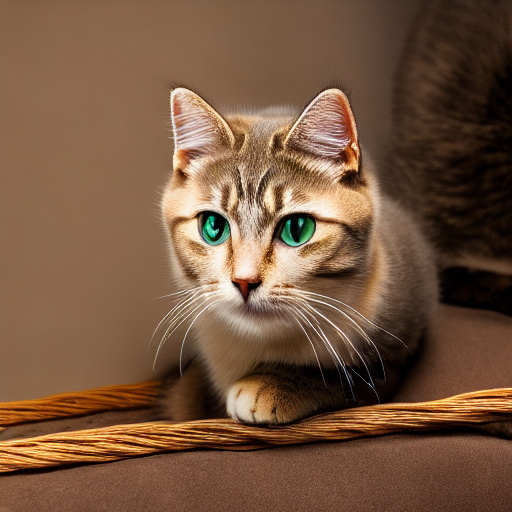

### Configuration Utilisée

*   **Modèle**: `runwayml/stable-diffusion-v1-5`
*   **Scheduler**: `DDIM`
*   **Seed**: `42`
*   **Prompt**: `A beautiful cat, photorealistic, 4k`
*   **Negative Prompt**: `ugly, tiling, poorly drawn hands, poorly drawn feet, poorly drawn face, out of frame, extra limbs, disfigured, deformed, body out of frame, blurry, bad anatomy, blurred, watermark, grainy, signature, cut off, draft`
*   **Pas d'inférence (num_inference_steps)**: `30`
*   **Échelle de guidage (guidance_scale)**: `7.5`
*   **Dimensions**: `512x512`

## Question 3:

**Paramètres des expériences**

*   **Prompt**: "A professional e-commerce photograph of a luxury blue suede shoe, studio lighting, plain background"
*   **Seed**: 42

| Run ID           | Scheduler | Steps | Guidance (γ) | Objectif de l'expérience                     |
| :--------------- | :-------- | :---- | :----------- | :------------------------------------------- |
| `run01_baseline` | EulerA    | 30    | 7.5          | Référence de base                            |
| `run02_steps15`  | EulerA    | 15    | 7.5          | Évaluer l'effet de `steps` insuffisants      |
| `run03_steps50`  | EulerA    | 50    | 7.5          | Évaluer l'effet de `steps` élevés            |
| `run04_guid4`    | EulerA    | 30    | 4.0          | Évaluer l'effet d'une `guidance` faible      |
| `run05_guid12`   | EulerA    | 30    | 12.0         | Évaluer l'effet d'une `guidance` forte       |
| `run06_ddim`     | DDIM      | 30    | 7.5          | Comparer l'impact du `scheduler`             |

### Grille de Comparaison Visuelle

| Run 1: Baseline   (EulerA, 30 steps, γ=7.5) | Run 2: Steps bas   (15 steps) | Run 3: Steps hauts   (50 steps) |
| :---: | :---: | :---: |
| 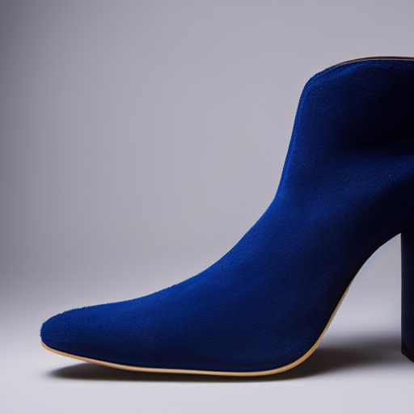 | 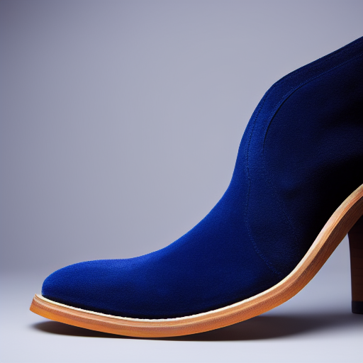 | 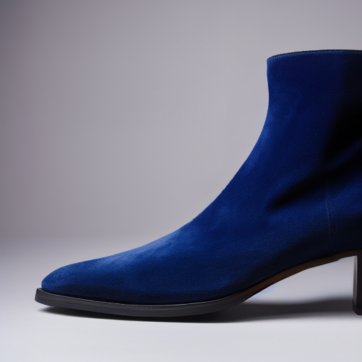 |
| **Run 4: Guidance bas   (γ=4.0)** | **Run 5: Guidance haut   (γ=12.0)** | **Run 6: Scheduler DDIM** |
| 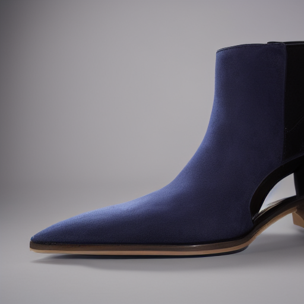 | 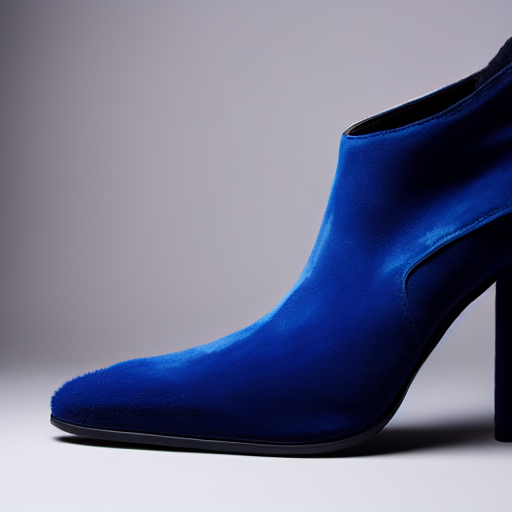 | 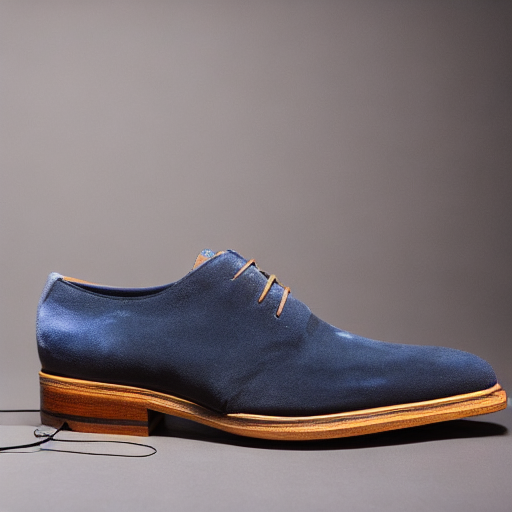 |

### Analyse Technique des Résultats

*   **Impact du Nombre de Pas d'Inférence (`steps`)**:
    *   **Run 2 (15 steps)**: Le processus de débruitage est manifestement incomplet. On note la présence d'artefacts et un manque de netteté global.
    *   **Run 3 (50 steps) vs Run 1 (30 steps)**: Le passage de 30 à 50 `steps` apporte un gain marginal en termes de finesse des micro-textures, mais au prix d'une augmentation significative du temps d'inférence. Le ratio coût/bénéfice favorise une valeur autour de 30 `steps`.

*   **Impact de l'Échelle de Guidage (`guidance_scale`)**:
    *   **Run 4 (γ=4.0)**: Une `guidance` faible accorde trop de liberté au modèle, qui s'écarte du concept de "photographie de produit". Le résultat est plus artistique mais ne respecte pas les contraintes commerciales (réalisme).
    *   **Run 5 (γ=12.0)**: À l'inverse, une `guidance` forte engendre une sur-optimisation. Les couleurs deviennent sur-saturées et les contrastes excessifs, dégradant le photoréalisme de l'image.

*   **Impact du `Scheduler`**:
    *   **Run 1 (EulerA) vs Run 6 (DDIM)**: `EulerA` a produit un rendu plus doux, avec des transitions douces. `DDIM` produit des images avec des textures plus "dures" et des détails plus marqués et plus réalistes. 

## Question 4:

### Grille de comparaison visuelle

| Image Source | Strength = 0.35 | Strength = 0.60 | Strength = 0.85 |
| :---: | :---: | :---: | :---: |
| 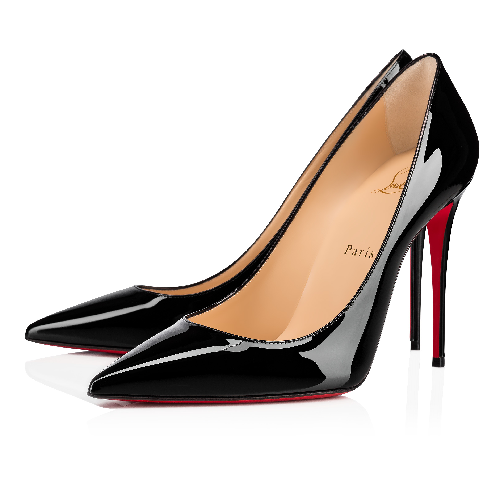 | 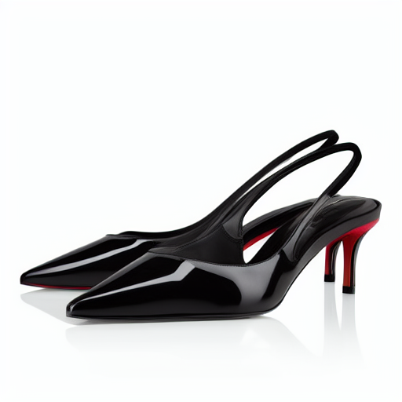 | 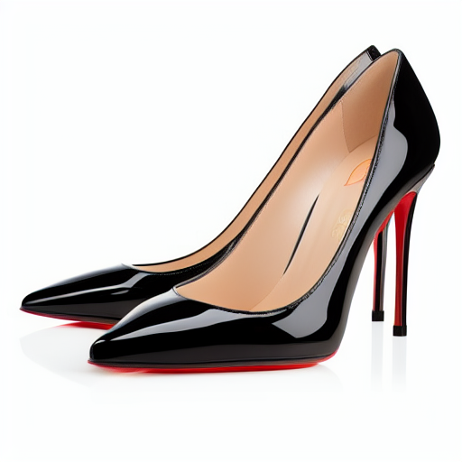 | 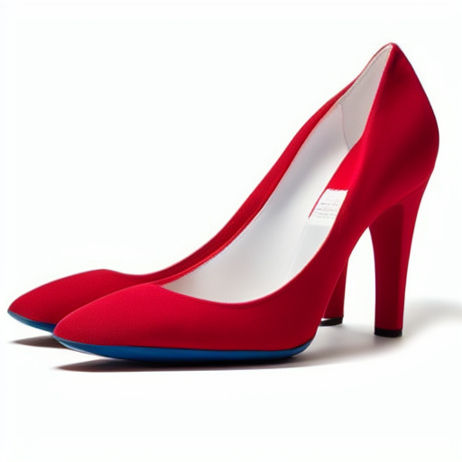 |

### Analyse Qualitative de l'Effet du `strength`

*   **Ce qui est conservé à travers les `strengths`** :
    *   La composition générale et le cadrage de l'objet (le soulier orienté vers la gauche) restent globalement intacts. Le modèle ne réinvente pas la pose du produit.
    *   L'identité fondamentale du produit (un soulier rouge) est préservée, même si les détails et le style changent.

*   **Ce qui change avec l'augmentation du `strength`** :
    *   **Strength = 0.35 (Run 07)**:
        *   Les changements sont subtils. La structure de l'image source est presque parfaitement conservée.
        *   Le logo sur le côté de la chaussure est  déformé.
    *   **Strength = 0.60 (Run 08)**:
        *   L'image est une réinterprétation claire. Le style visuel change de manière notable.
        *   La forme du soulier change. 
    *   **Strength = 0.85 (Run 09)**:
        *   Les modifications sont drastiques et l'image s'éloigne de la source. La forme générale du soulier change radicalement: la forme de la semelle et le design sont complètement réinventés par le modèle.
        *   La couleur rouge persiste.

### Commentaire sur l'utilisabilité E-commerce

*   Un `strength` faible **(0.35)** est parfait pour des tâches de nettoyage ("clean-up") ou de légères retouches, comme uniformiser un arrière-plan ou corriger de petits défauts, sans risquer d'altérer l'apparence du produit.
*   Un `strength` moyen **(0.60)** est idéal pour du "re-styling" de catalogue. Il permet de standardiser une série de photos de produits sur un même fond et sous un même éclairage, ce qui est très utile pour l'homogénéité d'un site e-commerce.
*   Un `strength` élevé **(0.85)** présente un **risque commercial majeur** pour la photographie de produit. L'image générée ne correspond plus au produit qui serait expédié au client, créant un problème de non-conformité. Ce niveau de `strength` est à réserver pour de la recherche de concepts, de la publicité créative ou de la direction artistique, mais ne doit pas être utilisé pour représenter un produit existant.

