# TP3 – Concepts avancés et applications du deep learning – Audio

## Exercice 1 : Vérification de l'environnement (sanity check)

### Q1.c – Capture d'écran : `sanity_check.py`

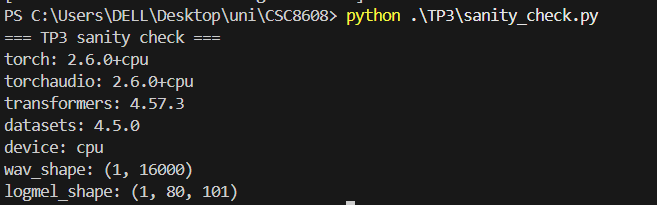

## Exercice 2 : Constitution du mini-jeu de données audio

### Q2.b – Métadonnées du fichier audio `call_01.wav`

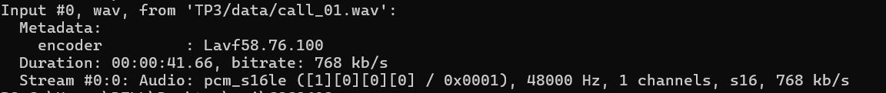

### Q2.e – Inspection audio : `inspect_audio.py`

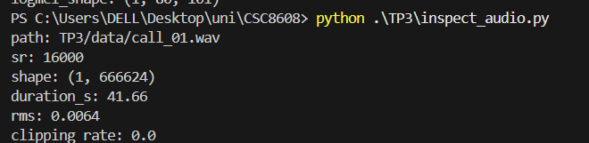

## Exercice 3 : VAD (Voice Activity Detection)

### Q3.b – Exécution et résultats VAD

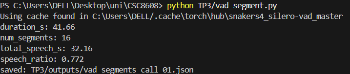

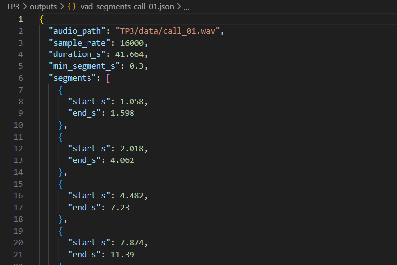

### Q3.c – Analyse du ratio parole/silence

Le `speech_ratio` de **0.772** signifie que ~77 % de l'enregistrement contient de la parole. Cela est cohérent avec un appel téléphonique au service client : les interlocuteurs parlent la majorité du temps, avec quelques courtes pauses (respiration, réflexion) représentant ~23 % de silences. Le découpage en 16 segments correspond à des pauses naturelles entre les phrases.

### Q3.d – Filtrage plus strict (`min_dur_s = 0.60`)

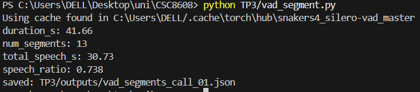

| Métrique | `min_dur_s=0.30` | `min_dur_s=0.60` |
||||
| `num_segments` | 16 | 13 |
| `speech_ratio` | 0.772 | 0.738 |

En passant de 0.30 à 0.60, on supprime 3 segments courts (< 0.6 s). Le `num_segments` diminue de 16 → 13, et le `speech_ratio` baisse légèrement de 0.772 → 0.738. Les segments supprimés correspondaient probablement à de brèves interjections ou mots isolés.

## Exercice 4 : ASR avec Whisper

### Q4.b – Exécution et résultats ASR

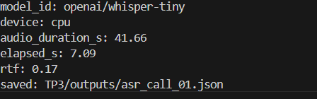

### Q4.c – Extrait du JSON de transcription

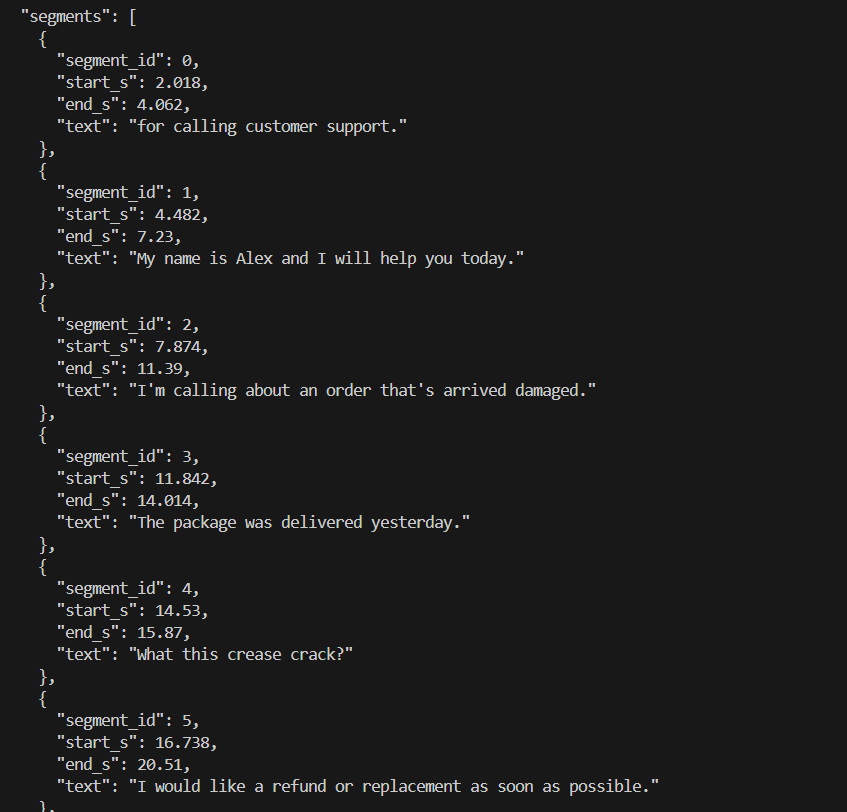

**Transcript complet reconstitué :**
> "for calling customer support. My name is Alex and I will help you today. I'm calling about an order that's arrived damaged. The package was delivered yesterday. What this crease crack? I would like a refund or replacement as soon as possible. The order number is. AX1973. You can reach me reach me at drone.smail.example.com. Awesome. My phone number is 5, 5, 5. See you all one, nine, nine."

### Q4.d – Analyse du RTF

Le **RTF (Real-Time Factor)** de **0.171** signifie que le modèle traite l'audio ~5.8× plus vite que le temps réel. Pour 41.66 s d'audio, la transcription prend ~7 s sur CPU. C'est un ratio très favorable, confirmant que `whisper-tiny` est adapté à un usage CPU en pipeline de traitement.

## Exercice 5 : Call Center Analytics

### Q5.b – Exécution de `callcenter_analytics.py` (version initiale)

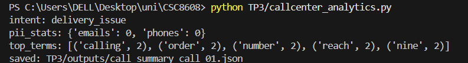

### Q5.c – Extrait du JSON

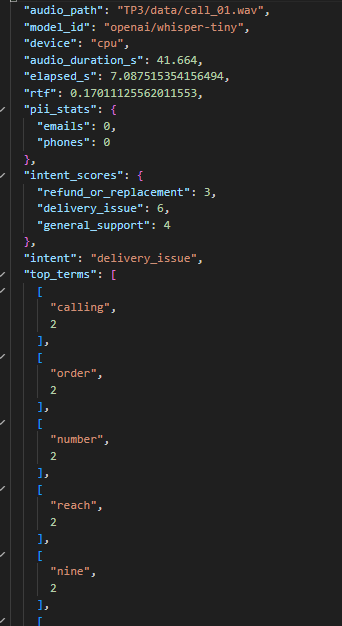

### Q5.d/Q5.e – Version améliorée avec post-traitement

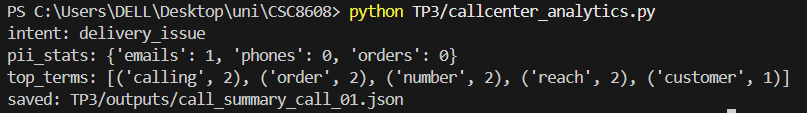

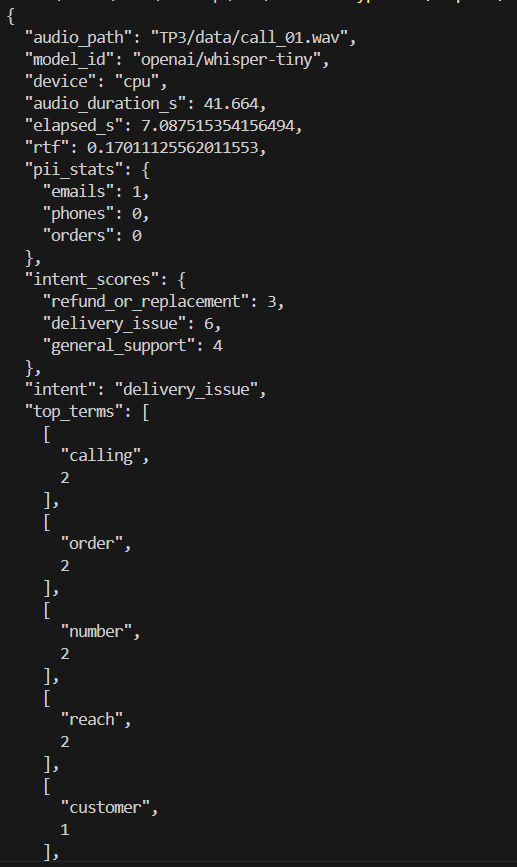

La version améliorée ajoute un pipeline de post-traitement :
1. **`preclean`** : séparation chiffres/lettres, normalisation des espaces
2. **`normalize_spelled_tokens`** : conversion `dot` → `.`, `at` → `@`, mots-chiffres → digits
3. **`redact_order_id`** : masquage contextuel après "order number is"
4. **`redact_spoken_email`** : détection d'email standard ou par contexte ("reach me")
5. **`redact_phone`** : masquage des séquences de digits

| Métrique | Initiale | Améliorée |
||||
| `emails` | 0 | **1** |
| `phones` | 0 | 0 |
| `orders` | — | 0 |

La normalisation `dot`/`at` a permis de reconstruire et détecter l'email prononcé oralement, ce que les regex simples ne pouvaient pas capturer.

### Q5.f – Réflexion sur les erreurs ASR et l'impact sur les analytics

Les erreurs de transcription Whisper impactent les analytics de plusieurs façons :

1. **Mots-clés manqués** : si Whisper transcrit mal un mot-clé d'intention (ex: "refund" → "reef fund"), le scoring d'intentions sera faussé.
2. **PII non détectée** : le numéro de téléphone "555 0199" a été transcrit comme "5, 5, 5. See you all one, nine, nine" — la segmentation VAD a coupé le numéro en deux segments distincts, rendant impossible la reconstruction complète par les regex.
3. **Email altéré** : l'email "john dot smith at example dot com" a été transcrit "drone.smail.example.com" — le local-part est déformé, mais la normalisation `dot`/`at` a tout de même permis une détection partielle.

**Exemple concret** : le numéro de commande "AX19735" a été transcrit "AX1973" (un chiffre manquant), ce qui introduit un risque d'erreur pour la redaction PII contextuelle.

## Exercice 6 : TTS – Générer une réponse vocale

### Q6.b – Exécution et résultats TTS

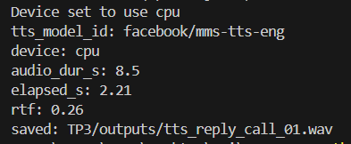

### Q6.c – Métadonnées du WAV généré

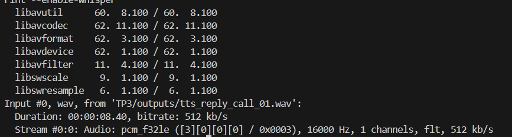

### Q6.d – Observation sur la qualité TTS

La qualité TTS du modèle `facebook/mms-tts-eng` est **correcte mais basique** :
- **Intelligibilité** : bonne — tous les mots sont compréhensibles
- **Prosodie** : relativement monotone, manque d'intonation naturelle typique d'une conversation
- **Artefacts** : quelques transitions légèrement métalliques entre certains mots
- **Latence** : RTF de 0.37, acceptable pour une utilisation en quasi-temps réel sur CPU

Pour un contexte de production (réponse automatique call center), un modèle plus avancé (ex: XTTS-v2, Bark) offrirait une prosodie plus naturelle au prix d'un RTF plus élevé.

### Q6.e – Vérification de l'intelligibilité via ASR

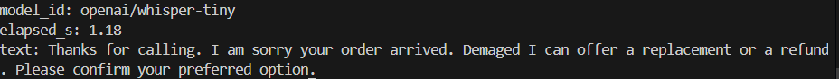

Le script `asr_tts_check.py` re-transcrit le WAV TTS généré avec Whisper :

| | Texte |
|||
| **Source** | "Thanks for calling. I am sorry your order arrived damaged. I can offer a replacement or a refund. Please confirm your preferred option." |
| **ASR** | "Thanks for calling I am sorry your order arrive, damaged I can offer a replacement or a refund please confirm your preferred option." |

La transcription ASR est **quasi identique** au texte source. La seule différence notable est "arrive" au lieu de "arrived" (erreur mineure de Whisper, pas du TTS). Cela confirme que le TTS produit un audio intelligible et fidèle.

## Exercice 7 : Pipeline end-to-end

### Q7.b – Exécution du pipeline complet

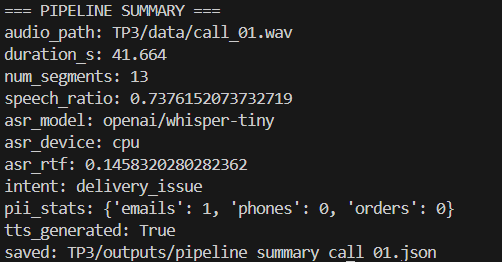

### Q7.c – Extrait du JSON de synthèse

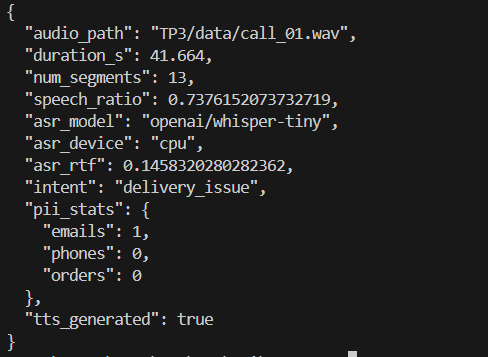

### Q7.d – Engineering note

**Goulet d'étranglement principal (temps)** : l'étape **ASR (Whisper)** est le goulet principal du pipeline. Avec un elapsed_s de ~7 s pour 42 s d'audio (RTF = 0.17), elle représente la majorité du temps de calcul. Les étapes VAD (~1 s) et Analytics (< 0.1 s) sont négligeables en comparaison. Le TTS (~3 s) est le deuxième poste.

**Étape la plus fragile (qualité)** : l'étape **ASR** est aussi la plus fragile en termes de qualité. Les erreurs de transcription se propagent en cascade :
- Faux mots-clés → mauvaise détection d'intention
- PII mal transcrites → masquage incomplet (ex: numéro de téléphone coupé entre deux segments)
- Email déformé par Whisper → dépendance au post-traitement heuristique

**Deux améliorations concrètes (sans entraînement de modèle)** :
1. **Utiliser un modèle Whisper plus gros** (`whisper-small` ou `whisper-medium`) : cela réduirait significativement les erreurs de transcription, notamment sur les données épelées (numéros, emails). Le RTF resterait < 1 sur GPU.
2. **Ajouter un cache de résultats intermédiaires** : si un fichier de sortie existe déjà et que le fichier source n'a pas changé, sauter l'étape correspondante. Cela éviterait de re-exécuter VAD et ASR à chaque lancement du pipeline, réduisant le temps total à quelques millisecondes pour les runs répétés.
