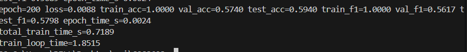
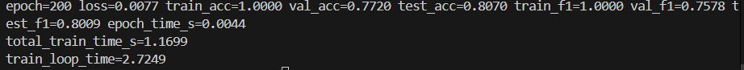
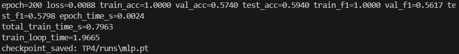
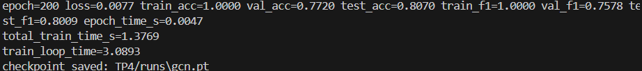
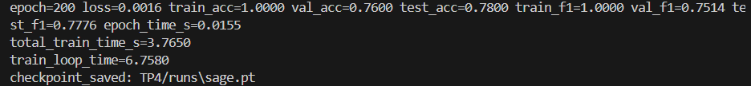
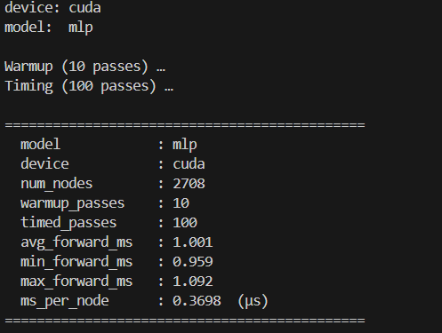
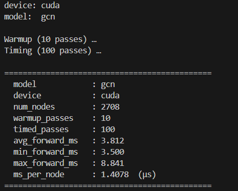
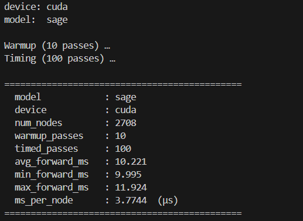

## Question 2:

On calcule les métriques séparément sur `train_mask`, `val_mask` et `test_mask` pour respecter un protocole d’évaluation propre et exploitable en pratique.
Le **train_mask** permet de suivre la dynamique d’apprentissage (est-ce que la loss baisse, est-ce que le modèle apprend réellement le signal ?).
Le **val_mask** sert à piloter les décisions d’ingénierie : tuning d’hyperparamètres, early stopping, choix d’architecture.
Le **test_mask** reste isolé pour estimer la performance finale sans fuite d’information ni biais d’optimisation.
Ici, on évalue à chaque epoch car Cora est petit ; sur un graphe industriel beaucoup plus large, on limiterait la fréquence d’évaluation pour réduire le coût compute.

## Question 3:
### MLP :

### GCN :

Voici une synthèse comparative de vos résultats sur le dataset Cora, suivie d'une analyse de la performance des modèles.

### Comparaison des performances

| Modèle | Test Acc | Test F1 | Temps (s) |
| --- | --- | --- | --- |
| **MLP**  | 0.5940 | 0.5798 | 0.7189 |
| **GCN** | **0.8070** | **0.8009** | 1.1699 |

---

### Pourquoi le GCN surpasse-t-il le MLP ici ?

Dans le contexte du dataset Cora (réseau de citations), le **GCN** obtient de bien meilleurs résultats car il exploite le **signal du graphe** là où le MLP s'arrête aux seules caractéristiques textuelles isolées.

* **Homophilie :** Cora repose sur le principe que des articles qui se citent traitent souvent du même sujet. Le GCN utilise cette structure pour propager l'information entre voisins.
* **Lissage (Smoothing) :** En agrégeant les vecteurs de caractéristiques des nœuds adjacents, le GCN réduit le bruit individuel et renforce les prédictions grâce au contexte local.
* **Limites du MLP :** Le MLP traite chaque document de manière indépendante. Si les **features** (mots-clés) sont insuffisantes ou ambiguës, il ne peut pas s'appuyer sur les relations explicites du réseau pour corriger son erreur, contrairement au GCN.

## Question 4 :
### MLP

### GCN

### SAGE

### Tableau synthétique des résultats

| Modèle    | test_acc | test_f1       | total_train_time_s | 
| --------- | -------- | ------------- | ------------------ | 
| MLP       | 0.594    | 0.5798        | 0.7963             |
| GCN       | 0.807    | 0.8009        | 1.3769             | 
| GraphSAGE | 0.780    | 0.7776        | 3.7650             | 

### Compromis du Neighbor Sampling

Le **neighbor sampling** consiste à ne sélectionner qu’un sous-ensemble de voisins (fanout) pour chaque nœud au lieu de tout le graphe.
Cela réduit fortement le **coût d’entraînement** et la mémoire GPU/CPU, surtout pour les graphes larges.
Chaque mini-batch devient plus léger, ce qui accélère les forward/backward passes.
Cependant, cette approche introduit de la **variance dans l’estimation des gradients**.
Les nœuds très connectés (**hubs**) peuvent être sous-échantillonnés, biaisant l’agrégation.
Le risque est une **légère perte de précision** ou des fluctuations de performance entre epochs.
Il faut donc **choisir le fanout avec soin** pour équilibrer rapidité et qualité.
Enfin, l’optimisation CPU du sampling est essentielle pour éviter que la préparation des batches devienne un goulot d’étranglement.

## Question 5:
### MLP

### GCN

### SAGE

### Tableau synthétique des résultats

| Modèle    | test_acc | test_macro_f1 | total_train_time_s | avg_forward_ms |
| --------- | -------- | ------------- | ------------------ | -------------- |
| MLP       | 0.5940   | 0.5798        | 0.7963             | 1.001          |
| GCN       | 0.8070   | 0.8009        | 1.3769             | 3.812          |
| GraphSAGE | 0.7800   | 0.7776        | 3.7650             | 10.221         |

**Pourquoi faire un warmup et synchroniser CUDA avant/après la mesure :**

Lorsqu’on exécute un modèle sur GPU, les opérations PyTorch sont **asynchrones** : le code Python peut continuer avant que le GPU ait fini de calculer.
Faire un **warmup** (quelques passes avant le chrono) permet de “chauffer” le GPU et d’atteindre un régime stable, car les premières passes incluent souvent l’allocation de mémoire et l’optimisation JIT.
La **synchronisation CUDA** (`torch.cuda.synchronize()`) avant et après chaque mesure garantit que toutes les opérations GPU sont terminées avant de commencer ou d’arrêter le timer.
Sans synchronisation, le temps mesuré pourrait être **faussement court** ou très variable.
Le warmup et la synchronisation assurent ainsi des mesures **stables et reproductibles**, ce qui est crucial pour comparer les performances des modèles.
Cela réduit l’impact des variations liées à la compilation JIT, à l’allocation de mémoire et à l’asynchronisme du GPU.

## Question 6:

| Modèle    | test_acc | test_macro_f1 | total_train_time_s | train_loop_time | avg_forward_ms |
| --------- | -------- | ------------- | ------------------ | --------------- | -------------- |
| MLP       | 0.5940   | 0.5798        | 0.7963             | 1.9665          | 1.001          |
| GCN       | 0.8070   | 0.8009        | 1.3769             | 3.0893          | 3.812          |
| GraphSAGE | 0.7800   | 0.7776        | 3.7650             | 6.7580          | 10.221         |

**Recommandation ingénieur :**
Le choix du modèle dépend du compromis entre **qualité** et **coût**.

* Le **MLP** est très rapide en inference (avg_forward_ms = 1 ms) et s’entraîne très vite (total_train_time_s = 0.7963 s), mais sa performance sur le test set est faible (test_acc = 0.594). Il convient pour des prototypes rapides ou des scénarios où la latence est critique et la précision moins importante.
* Le **GCN** offre le meilleur compromis avec une accuracy élevée (0.8070) et un Macro-F1 solide (0.8009), tout en restant raisonnable en temps d’entraînement et latence. C’est un bon choix général pour des graphes de taille moyenne où la qualité prime mais que le coût reste maîtrisable.
* Le **GraphSAGE** présente une bonne qualité (test_acc = 0.7800) mais un coût beaucoup plus élevé (total_train_time_s = 3.765 s, avg_forward_ms = 10.221 ms). Il est adapté aux graphes très grands ou lorsque l’on souhaite exploiter le “neighbor sampling” pour limiter la mémoire GPU, mais ce choix peut introduire de la variance et ralentir fortement l’inférence si on ne fait pas attention.

**Risque de protocole :**
La comparaison peut être faussée si les expériences ne sont pas strictement contrôlées. Par exemple, un **seed différent** pourrait générer des splits de données ou des initialisations de modèle différentes, faussant test_acc/test_f1. De même, des mesures sur **CPU vs GPU** ou des effets de **caching** pourraient rendre les temps non comparables. Dans un vrai projet, on éviterait ces biais en fixant le seed, en utilisant les mêmes splits et en mesurant sur le même matériel avec synchronisation GPU, et en répétant plusieurs runs pour obtenir des moyennes stables.

**Remarque dépôt :**
Tous les fichiers volumineux ont été exclus du dépôt.

