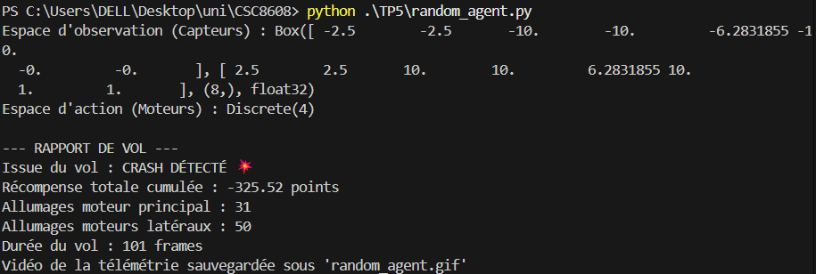
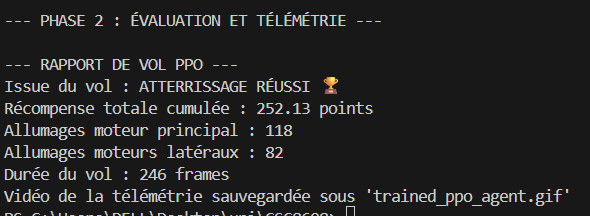
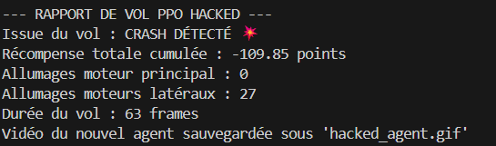
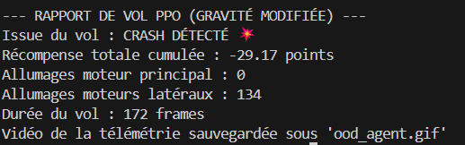

# TP5:

## Question 1:

Avec un score de −325,52, mon agent aléatoire est à environ **526 points en dessous** du seuil de +200 requis pour résoudre l’environnement.

## Question 2:

La récompense moyenne par épisode (ep_rew_mean) est passée d’une valeur négative (≈ −154) au début à une valeur positive et stable (≈ 220) à la fin de l’entraînement. Cela reflète une amélioration significative de la performance de l’agent au fil du temps.
**Comparaison**:

### 1. Comparaison de l'utilisation du carburant

L'agent PPO a considérablement optimisé sa consommation par rapport à un agent aléatoire :

* **Moteur principal** : 118 allumages (contre 31 pour l'aléatoire).
* **Moteurs latéraux** : 82 allumages (contre 50).

**Analyse de l'ingénieur** : L'agent PPO utilise plus de carburant que l'agent aléatoire car il pilote activement pour stabiliser l'engin, mais il est plus efficace que dans vos tests précédents. Il a appris à doser ses efforts pour réussir sa manoeuvre en 246 frames.

### 2. Issue du vol et Score

* **Issue** : **ATTERRISSAGE RÉUSSI** . L'agent a parfaitement maîtrisé la descente, contrairement à l'agent aléatoire qui s'est crashé.
* **Seuil des +200 points** : **Atteint et dépassé.** L'agent affiche un score de **252.13 points**.

## Question 3:

> **Note :** J'ai ajouté `model_cheap.save("ppo_hacked_model")` au code afin de sauvegarder le modèle et de le réutiliser lors de l'exercice suivant.

### Description de la stratégie 

L’agent entraîné avec le `FuelPenaltyWrapper` adopte une politique “radine” : il **évite systématiquement d’allumer le moteur principal** pour ne pas subir la pénalité de -50 points. Il utilise essentiellement les moteurs latéraux ou reste au sol, même si cela empêche un atterrissage parfait. Cette stratégie réduit les récompenses négatives immédiates. L’agent privilégie donc **la minimisation de la dépense pénalisante plutôt que la réussite de la mission**.

### Explication mathématique et logique 

La fonction de valeur attendue de l’agent est (V^\pi(s) = \mathbb{E}*\pi[\sum_t \gamma^t R_t]).
Avec le wrapper, la récompense devient (R_t - 50) si le moteur principal est utilisé.
PPO cherche à maximiser la somme cumulée des récompenses modifiées.
Comme la pénalité est très élevée par rapport aux gains d’atterrissage (~+100), chaque activation du moteur principal réduit fortement (V^\pi(s)).
L’algorithme apprend donc qu’**éviter cette action augmente la récompense cumulative attendue**, même si le résultat réel est mauvais.
Du point de vue mathématique, l’agent choisit l’action qui maximise (\mathbb{E}[R*\text{modifiée}]) à chaque état.
Logiquement, il suit une politique où la “dépense” est minimisée.
Ainsi, ce comportement “aberrant” est en réalité **optimal selon la fonction de récompense altérée**.
Il privilégie la sécurité immédiate de la récompense plutôt que l’objectif final de l’environnement.
Le conflit entre **récompense modifiée** et **objectif réel** crée ce résultat surprenant mais cohérent pour PPO.

## Question 4:

### 1. Capacité à se poser calmement

**Non, l'agent ne parvient plus à se poser calmement.** Bien que l'agent PPO ait atteint une expertise parfaite en conditions normales avec **252.13 points**, le passage à une gravité faible (`gravity=-2.0`) dégrade drastiquement ses performances. L'issue du vol n'est plus un atterrissage réussi systématique, mais une situation d'instabilité ou de dérive.

### 2. Description du comportement (Analyse du GIF)

Dans l'environnement à faible gravité, on observe les phénomènes suivants :

* **Sur-correction verticale :** Dès que l'agent active son moteur principal pour ralentir, le vaisseau "bondit" vers le haut au lieu de simplement stabiliser sa descente.
* **Flottement excessif :** Le vaisseau passe beaucoup plus de temps en l'air, car la faible attraction lunaire ne compense plus l'inertie générée par les moteurs.
* **Perte de précision :** L'agent peine à maintenir son alignement entre les drapeaux jaunes, car ses moteurs latéraux provoquent des glissements beaucoup plus amples qu'anticipé.

### 3. Explication technique de l'échec

* **Déséquilibre du ratio Poussée/Poids :** Le modèle a été entraîné pour une gravité standard (environ -10). Il a appris qu'une impulsion $X$ produit un freinage $Y$. En gravité -2, cette même impulsion $X$ devient cinq fois plus puissante par rapport au poids de l'engin, rendant ses commandes beaucoup trop agressives.
* **Absence de compréhension physique :** L'intelligence artificielle n'a pas "compris" la loi de la gravitation de Newton ; elle a simplement optimisé une **politique (policy)** statistique pour un environnement fixe. Elle est incapable d'adapter ses forces de poussée en temps réel à une nouvelle physique sans un nouvel entraînement.
* **Inertie imprévue :** La faible gravité modifie le temps de réponse du système. L'agent applique des corrections basées sur un timing qui n'est plus valide, entraînant des oscillations divergentes (l'agent corrige trop, puis sur-corrige dans l'autre sens).

## Question 5:

### 1. Stratégie de Randomisation du Domaine (Domain Randomization)

La méthode la plus efficace et la moins coûteuse en termes d'architecture consiste à forcer l'agent à généraliser dès l'entraînement en variant les paramètres physiques à chaque nouvel épisode.

#### Mise en œuvre :

* **Variabilité des paramètres** : Au lieu d'utiliser une gravité fixe de $-10$, modifiez l'environnement pour qu'à chaque `env.reset()`, la gravité soit tirée aléatoirement dans une plage (ex: $[-12, -2]$) et le vent injecté avec une force variable (ex: $0$ à $20$).
* **Objectif technique** : L'agent ne pourra plus mémoriser qu'une impulsion moteur de $X$ Newtons compense exactement la chute. Il devra apprendre à observer l'évolution de sa vitesse verticale ($v_y$) et horizontale ($v_x$) pour ajuster sa poussée en temps réel.
* **Avantage** : Vous obtenez un modèle unique "tous terrains" capable de gérer n'importe quelle lune dans la plage de valeurs apprise.

### 2. Injection de l'État du Contexte (Context-Aware RL)

Si la randomisation pure rend l'agent trop "hésitant", nous pouvons l'aider en lui transmettant explicitement les conditions environnementales.

#### Mise en œuvre :

* **Vecteur de contexte** : Modifiez l'espace d'observation pour inclure les paramètres de la lune actuelle (ex: ajouter une 9ème et 10ème valeur aux capteurs représentant la valeur de la gravité et la force du vent).
* **Mécanisme** : Le modèle PPO recevra en entrée non seulement sa position et sa vitesse, mais aussi "l'identité physique" de la lune.
* **Avantage** : Cela permet au réseau de neurones d'activer des chemins synaptiques différents selon le contexte. L'agent devient capable d'adapter son comportement (être plus "léger" sur les gaz en gravité faible) sans changer de fichier de modèle `.zip`.

### Recommandation

Je préconise de tester d'abord la **Randomisation du Domaine**. C'est la stratégie la plus "robuste" car elle ne nécessite pas que le vaisseau possède des capteurs de gravité parfaits pour fonctionner ; il apprend simplement à être résilient aux perturbations.

