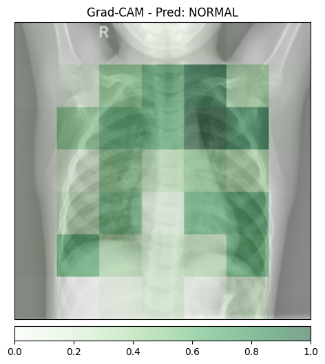
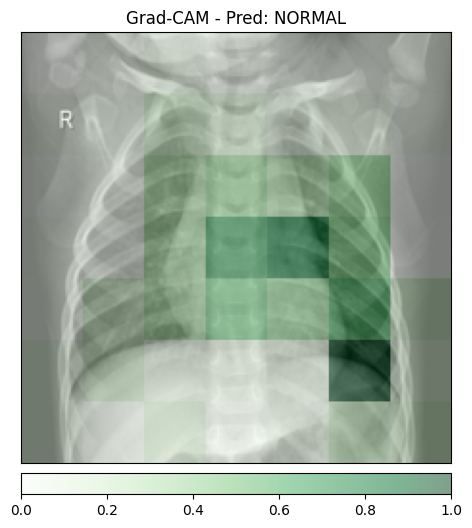
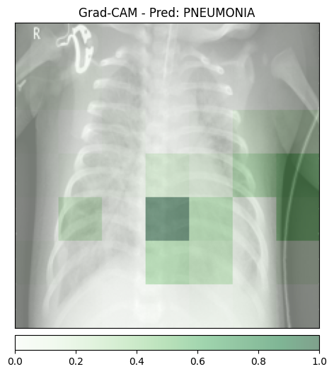
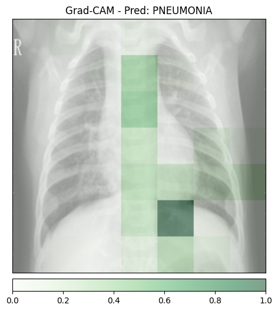
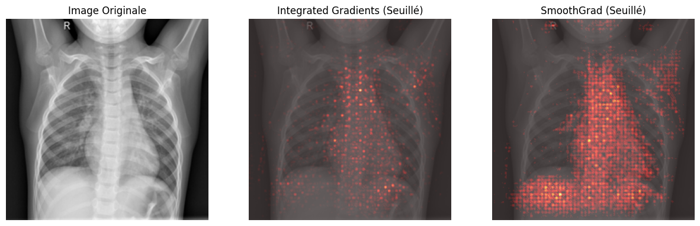
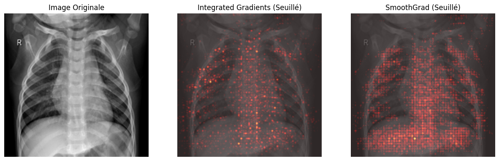
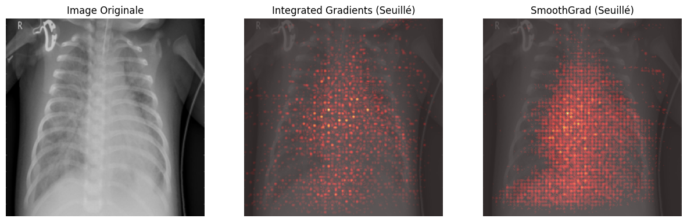
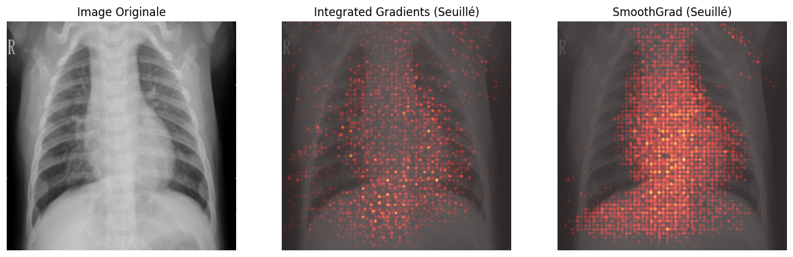
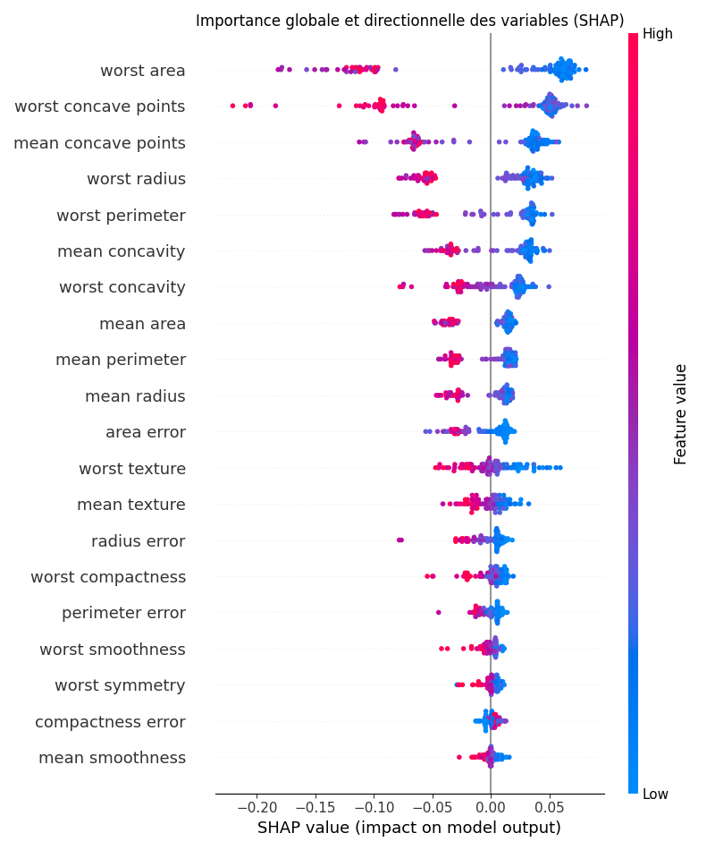
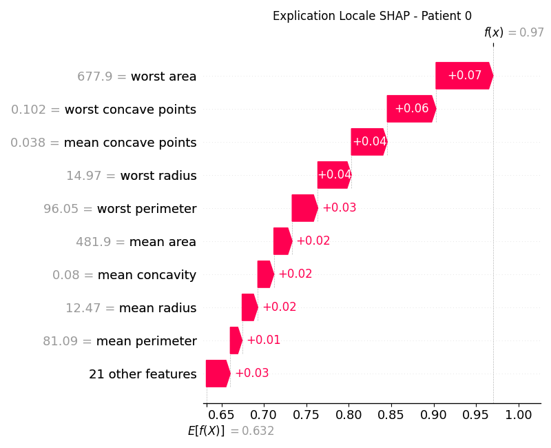

# TP6
## Exercice 1:
### 1. Visualisations 

|  |  | | |
| --- | --- | --- | --- |
|  |  |  |  |
| NORMAL 1|  NORMAL 1 | PNEUMONIA 1|  PNEUMONIA 2|

### 2. Analyse des Faux Positifs (Effet Clever Hans)

L'analyse des zones de chaleur révèle que le modèle ne se concentre pas exclusivement sur le parenchyme pulmonaire.
Sur certains clichés, comme gradcam_pneumo_2.png, on observe des activations marquées au niveau des marqueurs
radiographiques (lettre 'R') ou des structures osseuses périphériques. Ce phénomène, qualifié d'effet Clever Hans,
suggère que le réseau de neurones exploite des biais statistiques et des artefacts techniques plutôt que de
véritables signes cliniques de pathologie. Ainsi, une prédiction peut résulter d'une corrélation fallacieuse.

### 3. Granularité et Résolution Spatiale

La résolution des explications Grad-CAM est limitée par la structure architecturale du modèle ResNet utilisé.
En ciblant la dernière couche de l'encodeur, l'information provient d'une carte de caractéristiques fortement
réduite spatialement, typiquement de dimension $7 \times 7$. Pour obtenir une visualisation superposable, le script
applique une interpolation qui étire ces points de données en larges blocs diffus. Cette perte de granularité
est le prix à payer pour accéder aux concepts sémantiques de haut niveau appris par les couches profondes.

## Exercice 2:
### 1. Visualisations 

|  |  | | |
| --- | --- | --- | --- |
|  |  |  |  |
| NORMAL 1|  NORMAL 1 | PNEUMONIA 1|  PNEUMONIA 2|

### 2. Temps d'exécution et Architecture Temps Réel

Les relevés montrent un temps d'inférence d'environ **0.018s**, tandis que SmoothGrad nécessite environ **13.7s**. Ce délai de plus de dix secondes rend impossible une génération synchrone fluide pour un médecin en consultation immédiate. Pour résoudre ce goulot d'étranglement, il serait nécessaire de déployer une architecture **asynchrone basée sur une file d'attente (type RabbitMQ ou Redis)**, où l'inférence est immédiate mais l'explication détaillée est calculée en arrière-plan et notifiée à l'interface une fois prête.

### 3. Avantage Mathématique des Valeurs Négatives

Contrairement à Grad-CAM qui utilise un filtre ReLU pour ne garder que les gradients positifs, Integrated Gradients permet d'obtenir des attributions descendant en dessous de zéro. Mathématiquement, cela permet de distinguer les zones qui **contribuent positivement** au score de la classe (en rouge) de celles qui **infirment** la prédiction ou soutiennent une classe opposée. Cette approche offre une vision plus complète de la logique interne du modèle en montrant non seulement ce qui l'attire, mais aussi ce qui le fait douter.

## Exercice 3:

### 2. Identification de la Caractéristique Critique

En analysant le graphique, la caractéristique **"worst texture"** possède le coefficient négatif le plus élevé (environ -1.35). Dans ce jeu de données où la classe 0 correspond aux tumeurs malignes, c'est cette variable qui contribue le plus fortement à faire basculer la prédiction vers un diagnostic de **malignité**. Les autres facteurs majeurs incluent "radius error" et "worst symmetry", confirmant l'importance des irrégularités morphologiques.

### 3. Avantage des Modèles Intrinsèques

L'avantage majeur d'un modèle directement interprétable est qu'il fournit une explication **fidèle et exacte** de son propre mécanisme de décision sans risque d'approximation, contrairement aux méthodes post-hoc qui ne font qu'estimer le comportement d'une "boîte noire". Là où Grad-CAM ou Integrated Gradients tentent d'interpréter un modèle complexe après coup, la régression logistique expose ses propres poids comme une preuve mathématique directe du rôle de chaque variable.

## Exercice 4:

### 2. Explicabilité Globale et Robustesse des Biomarqueurs

Le **Summary Plot** de SHAP identifie **"worst area"**, **"worst concave points"** et **"mean concave points"** comme les variables les plus influentes pour le Random Forest. Bien que l'ordre diffère légèrement de la Régression Logistique (où "worst texture" dominait), on retrouve une convergence forte sur les mesures de surface et de concavité. Cette cohérence entre un modèle linéaire simple et un modèle de forêt aléatoire complexe démontre la **robustesse clinique** de ces caractéristiques, qui agissent comme de véritables biomarqueurs stables pour le diagnostic de malignité.

### 3. Explicabilité Locale (Patient 0)

L'analyse du **Waterfall Plot** pour le patient 0 montre que la caractéristique ayant le plus contribué à la décision finale est **"worst area"**. Elle a apporté une contribution positive de **+0.07** à la probabilité de la classe prédite. La valeur numérique exacte de cette caractéristique pour ce patient spécifique est de **677.9**.

